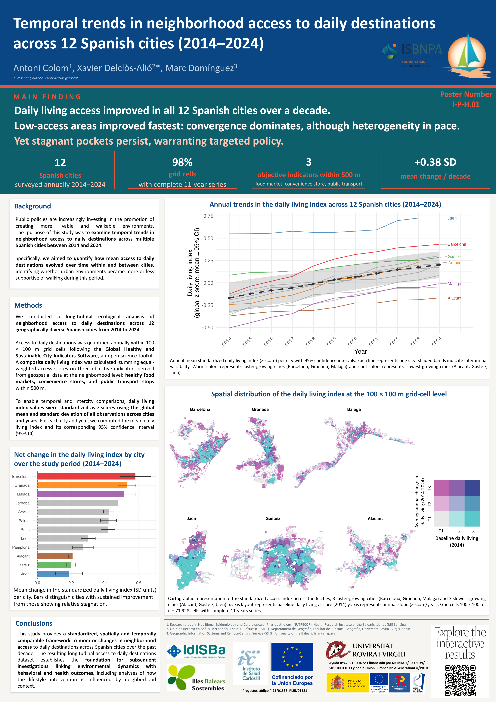

# Pre-Environs Research Project

         

------------------------------------------------------------------------

## About

**Pre-Environs** is a multidisciplinary research project investigating how the built, food, and social environment shapes physical activity, dietary behaviours, and cardiometabolic health outcomes.

Our work is anchored in **PRE-ENVIRONS** (*Influencia de los Entornos Obesogénicos Durante una Intervención para la Pérdida de Peso en el contexto del ensayo PREDIMED-PLUS*), a coordinated project funded by the **Instituto de Salud Carlos III** (Acción Estratégica en Salud 2025) that examines how obesogenic environments modify the effectiveness of a weight-loss intervention across Mediterranean populations.

The project builds on data from the [**PREDIMED-PLUS**](https://www.predimedplus.com/) randomised controlled trial (Spain, 2014–2022; n = 6,874 adults with overweight/obesity and metabolic syndrome) and evaluates three environmental dimensions via Geographic Information Systems:

-   **Built environment.** Walkability, green spaces and accessibility to open public spaces.
-   **Food environment.** Access to fresh produce markets, fast-food outlets and convenience stores.
-   **Social residential environment.** Socioeconomic and demographic context of the neighbourhood.

------------------------------------------------------------------------

## Research lines

The project is structured around three complementary research lines, derived from the funded PRE-ENVIRONS protocol (projects PI25/01521 and PI25/01538).

> **Working hypothesis.** Participants exposed to environments supportive of physical activity and healthy eating are more likely to initiate and sustain long-term healthy changes in body weight, body mass index and abdominal obesity.

### 1 · Characterising obesogenic environments

Comprehensive characterisation of the built, food and social environment surrounding the residences of the 6,874 PREDIMED-PLUS participants (men and women aged 55 to 75 with overweight or obesity and metabolic syndrome), recruited across 23 Spanish centres covering Andalusia, the Balearic and Canary Islands, the Valencian Community, Catalonia, Madrid, the Basque Country, Cantabria and Castile and León.

For each participant we delineate network walkable sausage buffers at 0.5, 1 and 1.5 km around the residence and, within each buffer, quantify four environmental constructs:

- **Access to open public spaces.** Green areas (parks, woodlands, nature reserves), blue areas (beaches, rivers, reservoirs) and sports facilities.
- **Walkability.** Population density, street intersection density and a daily living score (access to everyday food retail, basic services and public transport).
- **Access to food retail.** Density of, and distance to, supermarkets, municipal markets, specialised food stores (greengrocers, butchers, fishmongers), fast-food outlets and convenience stores.
- **Socioeconomic context.** Gini income inequality at the residence area, derived from the INE household-income atlas.

Geospatial data are extracted from OpenStreetMap with the [Global Healthy and Sustainable City Indicators](https://www.healthysustainablecities.org/) toolkit, complemented with GTFS public-transport feeds, INE socioeconomic atlases and remote-sensing layers. Residential addresses are geocoded in R with tidygeocoder and cross-validated against the Spanish cadastre and caRtociudad. Annual environmental layers cover the 2014 to 2024 period.

### 2 · Environmental modifiers of the PREDIMED-PLUS intervention response

Multilevel evaluation of how neighbourhood environmental exposures modify the effectiveness of the PREDIMED-PLUS intensive lifestyle intervention on changes in body weight, body mass index and abdominal obesity. The analysis covers the 6 years of active intervention and the 8-year post-intervention follow-up using three-level mixed models that nest annual measurements within participants and within municipalities. Behavioural mediators (leisure-time physical activity, measured by accelerometry and the REGICOR questionnaire; adherence to the energy-restricted Mediterranean diet, measured with the 17-item er-MEDAS) are analysed in parallel. All exposure-by-intervention interactions are disaggregated by sex.

### 3 · GIS-based predictive tool and knowledge transfer

Development of a sex-specific predictive model linking environmental exposures to changes in body weight, body mass index and abdominal obesity. Candidate algorithms (k-Nearest Neighbour, Naive Bayes, logistic regression, linear discriminant analysis, Random Forest) are trained on a random 80% of the cohort and validated on the remaining 20%. The best-performing model is delivered as an open interactive web cartographic viewer that identifies urban areas where targeted obesogenic-environment policies are most needed, with a planned technology transfer to clinical and urban-planning decision-makers.

------------------------------------------------------------------------

## Team

### IdISBa subproject (PI25/01538)

| Researcher | Role | Affiliation |
|------------------------|------------------------|------------------------|
| **Antoni Colom Fernández** | Principal Investigator | NUTRECOR Research Group · IdISBa |
| **Mauricio Ruiz Pérez** | GIS and Spatial Analysis | Department of Geography · University of the Balearic Islands |
| **Carles Homs Pérez** | GIS Development | Center for Geographic Information Technologies · University of the Balearic Islands |
| **Juan Bauzà Llinàs** | Remote Sensing and Spatial Analysis | Center for Geographic Information Technologies · University of the Balearic Islands |
| **Montserrat Compa Ferrer** | Environmental and Spatial Ecology | Department of Biology · University of the Balearic Islands |

### IBIMA subproject and coordination (PI25/01521)

| Researcher | Role | Affiliation |
|------------------------|------------------------|------------------------|
| **Julia Wärnberg** | Principal Investigator and Coordinator | EpiPHAAN Research Group · IBIMA Plataforma BIONAND · Universidad de Málaga |
| **Napoleón Pérez Farinós** | Co-Principal Investigator and Coordinator | EpiPHAAN Research Group · IBIMA Plataforma BIONAND · Universidad de Málaga |
| **F. Javier Barón López** | Mathematician and computer scientist | EpiPHAAN Research Group · IBIMA Plataforma BIONAND · Universidad de Málaga |

------------------------------------------------------------------------

## Funding

Funded by **Instituto de Salud Carlos III**, *Proyectos de I+D+I en Salud* (Acción Estratégica en Salud 2025), projects **PI25/01521** and **PI25/01538**, co-funded by the European Union.

    

------------------------------------------------------------------------

## Selected publications

-   Colom A, Pérez-Farinós N, Barón-López FJ, Ruiz-Pérez M, Domínguez-Mallafré M, Delclòs-Alió X, et al. Area-level socioeconomic inequalities in adiposity among older adults: the moderating effect of neighborhood walkability. *Journal of Urban Health*, 2026. <https://doi.org/10.1007/s11524-026-01102-1>

    *In 1,286 older adults from five Andalusian cities, walkable and dense neighbourhoods amplified, rather than narrowed, area-level socioeconomic inequalities in central adiposity (waist circumference and ABSI). The effect was driven mainly by population density and was absent for body mass index, calling for equity-focused, age-friendly walkability policies targeted to deprived neighbourhoods.*

-   Colom A, Mavoa S, Ruiz M, et al. Neighbourhood walkability and physical activity: moderating role of a physical activity intervention in overweight and obese older adults with metabolic syndrome. *Age and Ageing*, 2020. <https://doi.org/10.1093/ageing/afaa246>

    *Seminal study of the Pre-Environs research line. Showed that participants in highly walkable neighbourhoods benefited substantially more from the PREDIMED-PLUS intervention in terms of physical activity, providing the first PREDIMED-PLUS evidence of effect modification by the built environment.*

------------------------------------------------------------------------

## Conference presentations

### Temporal trends in neighbourhood access to daily destinations · 12 Spanish cities (2014–2024)

*Colom A, Delclòs-Alió X, Domínguez M. ISBNPA 2026 Annual Meeting, Cádiz. Poster I-P-H.01.*

**Live demo:** <https://preenvirons.github.io/bivariate-urban-access/> · **Download poster:** [PDF (3.8 MB)](assets/posters/ISBNPA2026_daily-living-trends.pdf)

A standardised, spatially and temporally comparable framework to monitor changes in neighbourhood access to daily destinations (healthy food markets, convenience stores and public transport stops within 500 m) across 12 Spanish cities over the past decade. The dataset feeds Research line 1.

- Mean daily living index improved by **+0.38 SD per decade** across all 12 cities, with 98% of grid cells covered by complete 11-year series.
- Largest gains in Barcelona, Granada and Málaga; slowest growth in Alacant, Gasteiz and Jaén.
- Low-access areas improved fastest, so convergence dominates, but stagnant pockets persist and warrant targeted policy.

  

------------------------------------------------------------------------

## Contact

preenvirons@gmail.com

IdISBa · Carretera de Valldemossa, 79 Hospital Universitario Son Espases. Edificio S. 07120 Palma Illes Balears. España. · idisba.info@idisba.es

IBIMA Plataforma BIONAND · Avenida Severo Ochoa, 35, 29590, Málaga. España. · info@ibima.eu